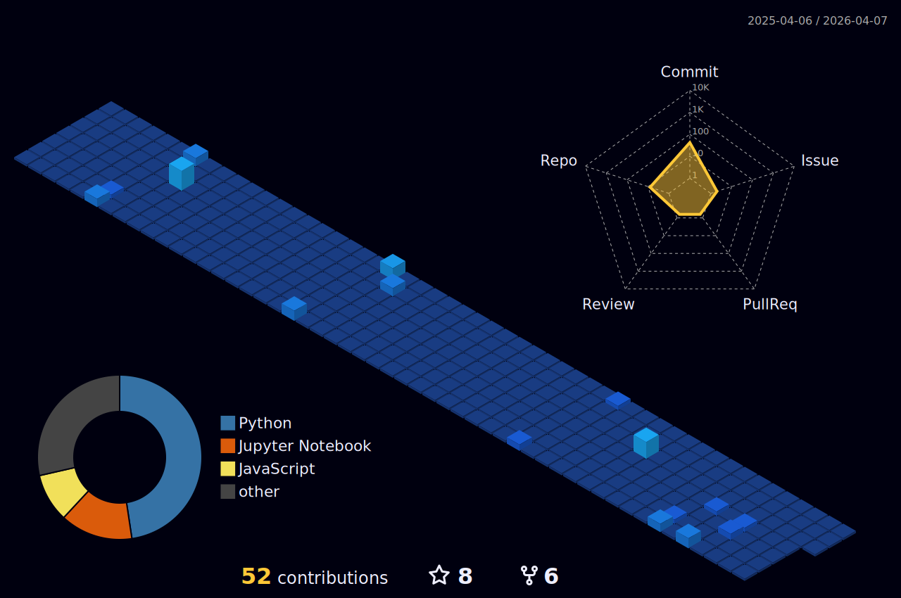

<h1 align="center">Abdelrahman Ashraf</h1>

  

  
  
  

  

  

---

<h3 align="center">Toolbox</h3>

  
  
  
  
  
  
  

  
  
  
  

---

<h3 align="center">3D Contribution Calendar</h3>

  

  

---

<h3 align="center">Contribution snake</h3>

  <picture>
    <source media="(prefers-color-scheme: dark)"
      srcset="https://raw.githubusercontent.com/AbdelrahmanAboegela/AbdelrahmanAboegela/output/github-contribution-grid-snake-dark.svg" />
    <source media="(prefers-color-scheme: light)"
      srcset="https://raw.githubusercontent.com/AbdelrahmanAboegela/AbdelrahmanAboegela/output/github-contribution-grid-snake.svg" />
    
  </picture>

